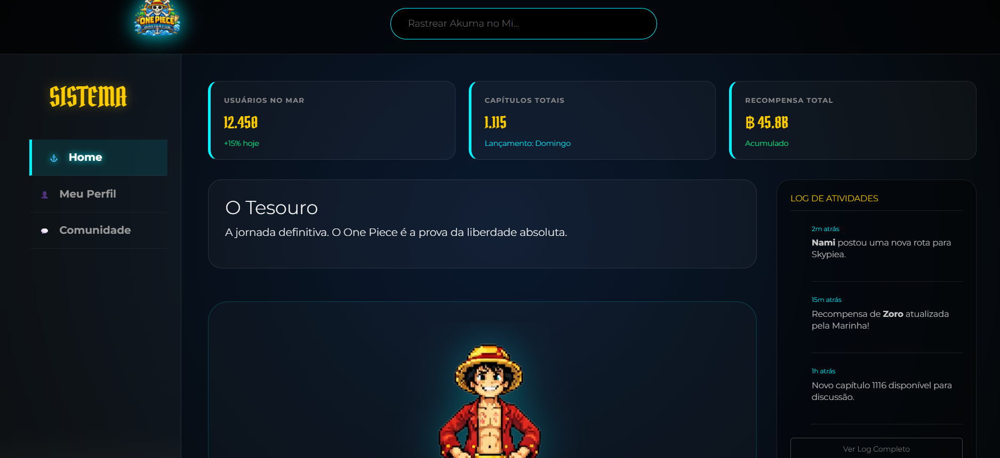
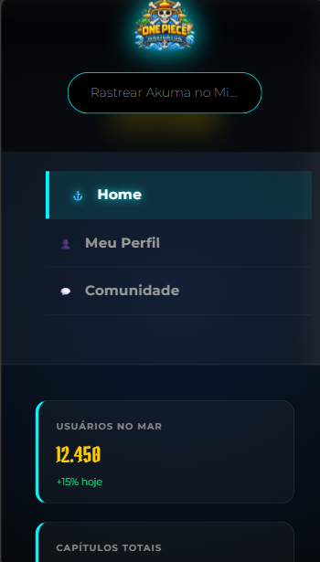

# Trabalho Prático - Semana 6

Nessa atividade, como sempre, vamos evoluir o que foi feito na semana anterior. Fique atento para fazer o projeto da semana anterior e dar sequência nessa jornada.

No trabalho dessa semana vamos alterar o projeto para que a responsividade da home-page seja feita, agora, com o framework Bootstrap.

**IMPORTANTE 1:** Você deve alterar apenas os arquivos **`README.md`**, **`index.html`** e **`styles.css`**, podendo incluir outros arquivos como imagens na pasta **`images`**, caso necessário. Deixe todos os demais arquivos e pastas desse repositório inalterados. **PRESTE MUITA ATENÇÃO NISSO.**

## Informações Gerais

- Nome: Caio Martins Caldeira
- Matricula: 907684
- Proposta de projeto escolhida: one piece navigator - o guia definitivo pra quem quer navegar sem se perder e ainda conferir as novidades do bando.
- Breve descrição sobre seu projeto: o projeto e basicamente um sistema web responsivo que simula a interface de um navegador pirata de verdade. usei o bootstrap 5 pra deixar tudo rodando liso tanto no pc quanto no celular, entao o layout se ajusta sozinho. olha o que tem de bom:

home: um painel cheio de estatisticas em tempo real (piratas online, capitulos ja lancados e o total de berries acumulado), alem de um feed de noticias e um carrossel com os personagens em pixel art.

meu perfil: uma area personalizada onde o usuario ganha seu proprio cartaz de procurado (wanted card) mostrando seu status e o valor da sua recompensa.

comunidade: um espaco pros piratas discutirem teorias e fanfics, com sistema de tags e um ranking de quem e o mais brabo do mar.

design: usei aquele estilo glassmorphism (efeito de vidro) misturado com a pegada classica de pirataria, com fontes tematicas e uns efeitos visuais modernos pra fechar o visual.

## Print da versão responsiva com Bootstrap [DESKTOP]

## Print da versão responsiva com Bootstrap [MOBILE] (*)

(*) Utilize as ferramentas do desenvolvedor do seu navegador para colocar no modo reponsivo, escolha um celular qualquer e recarregue a página antes de tirar o print. 